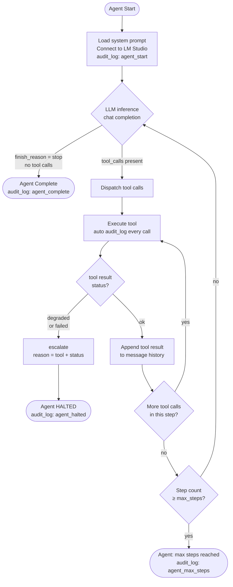
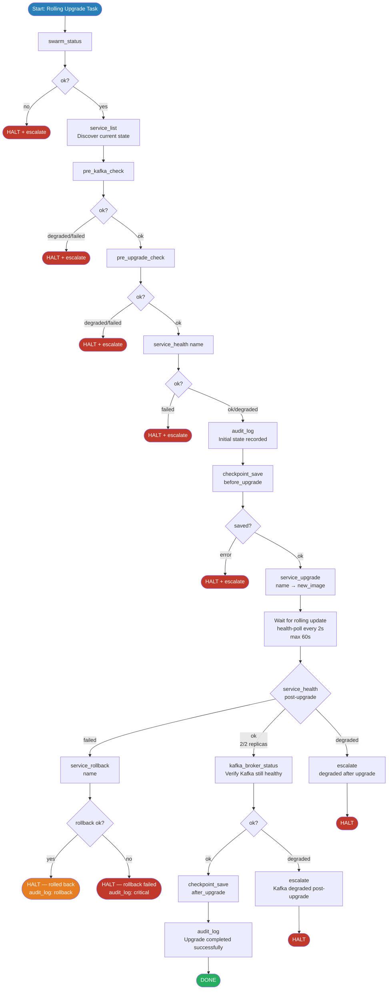
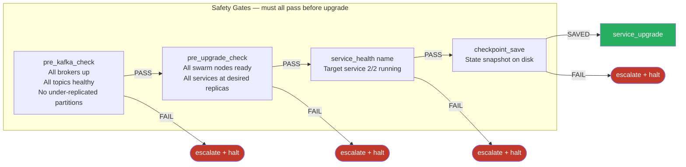
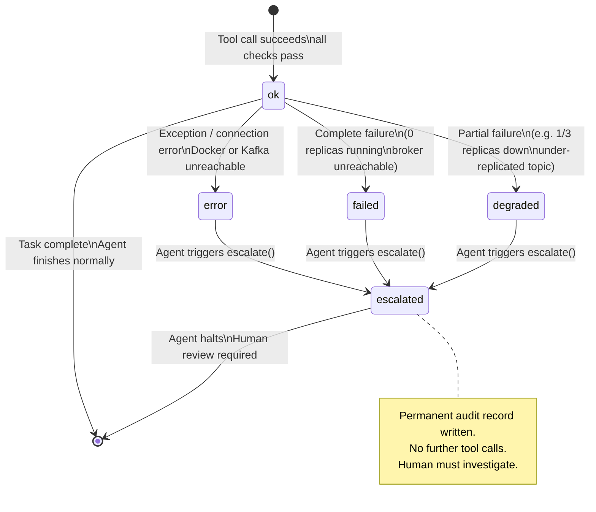

# Agent Decision Flow

The agent follows a strict **check → act → verify → continue or halt** loop.
Every branch that returns `degraded` or `failed` triggers `escalate()` and stops the agent.

---

## Main Agent Loop



---

## Rolling Upgrade Flow

The sequence the agent executes for a service rolling upgrade.



---

## Gate Hierarchy



---

## Tool Call Lifecycle

```mermaid
sequenceDiagram
    participant LLM as LLM (Qwen3)
    participant Loop as Agent Loop
    participant Tool as Tool Module
    participant Audit as Audit Log
    participant Infra as Docker/Kafka

    Loop->>LLM: chat.completions.create(messages, tools)
    LLM-->>Loop: response(tool_calls=[...])

    loop For each tool_call
        Loop->>Tool: dispatch(name, args)
        Tool->>Infra: API call (docker SDK / kafka-python)
        Infra-->>Tool: raw result
        Tool-->>Loop: {status, data, timestamp, message}
        Loop->>Audit: audit_log(tool:name, {args, status})
        alt status == degraded or failed
            Loop->>Tool: escalate(reason)
            Tool->>Audit: audit_log(ESCALATE, entry)
            Loop-->>Loop: HALT — stop all processing
        else status == ok
            Loop->>Loop: append tool result to messages
        end
    end

    Loop->>LLM: next inference with tool results
```

---

## Status State Machine



---

## ASCII Flow (terminal-friendly)

```
AGENT START
    │
    ▼
┌─────────────────────────────────────────┐
│  STEP 1: Environment Discovery          │
│  swarm_status() ──────────── ok? ──NO──▶ HALT
│  service_list()                          │
│  pre_upgrade_check() ─────── ok? ──NO──▶ HALT
│  pre_kafka_check() ───────── ok? ──NO──▶ HALT
│  kafka_broker_status()                   │
│  service_health(workload) ── ok? ──NO──▶ HALT
└───────────────────────┬─────────────────┘
                        │ ALL OK
                        ▼
┌─────────────────────────────────────────┐
│  STEP 2: Pre-Action Safety              │
│  audit_log("initial state", ...)        │
│  checkpoint_save("before_upgrade")      │
└───────────────────────┬─────────────────┘
                        │
                        ▼
┌─────────────────────────────────────────┐
│  STEP 3: Execute Upgrade                │
│  service_upgrade("workload",            │
│                  "nginx:1.26-alpine")   │
│  ┌── poll service_health every 2s ──┐  │
│  │   until ok or timeout (60s)      │  │
│  └───────────────────────────────────┘  │
│  result: failed? ──────────────────────▶ service_rollback() ──▶ HALT
│  result: degraded? ────────────────────▶ escalate() ──────────▶ HALT
└───────────────────────┬─────────────────┘
                        │ ok
                        ▼
┌─────────────────────────────────────────┐
│  STEP 4: Post-Upgrade Verification      │
│  service_health() ────────── ok?        │
│  swarm_status() ──────────── ok?        │
│  kafka_broker_status() ────── ok?       │
└───────────────────────┬─────────────────┘
                        │
                        ▼
┌─────────────────────────────────────────┐
│  STEP 5: Finalise                       │
│  checkpoint_save("after_upgrade")       │
│  audit_log("Upgrade completed", ...)    │
└───────────────────────┬─────────────────┘
                        │
                        ▼
                   AGENT DONE
```
