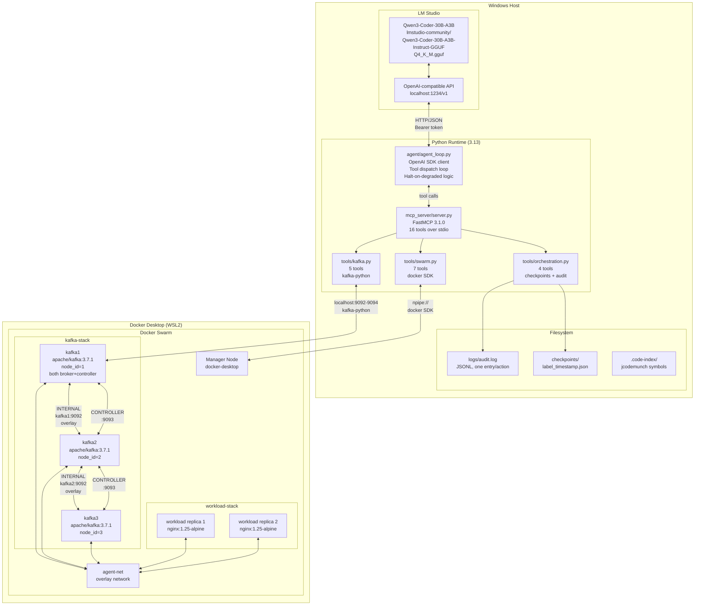
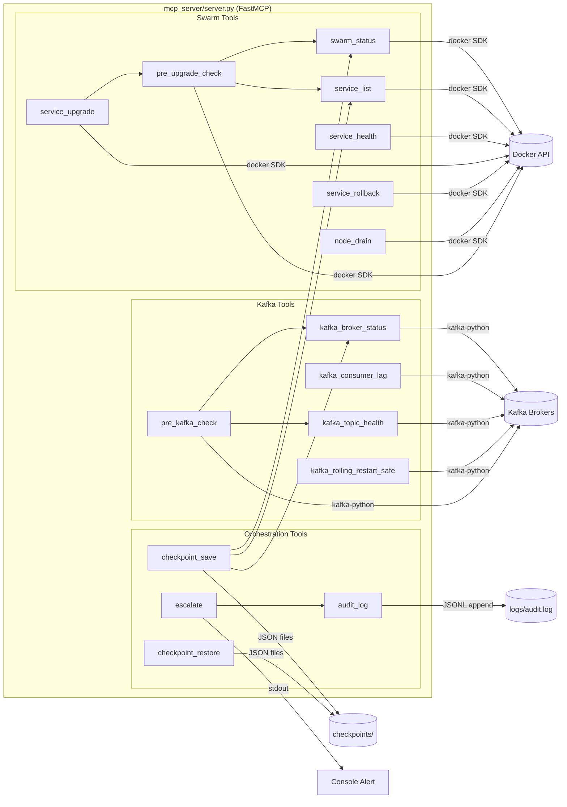
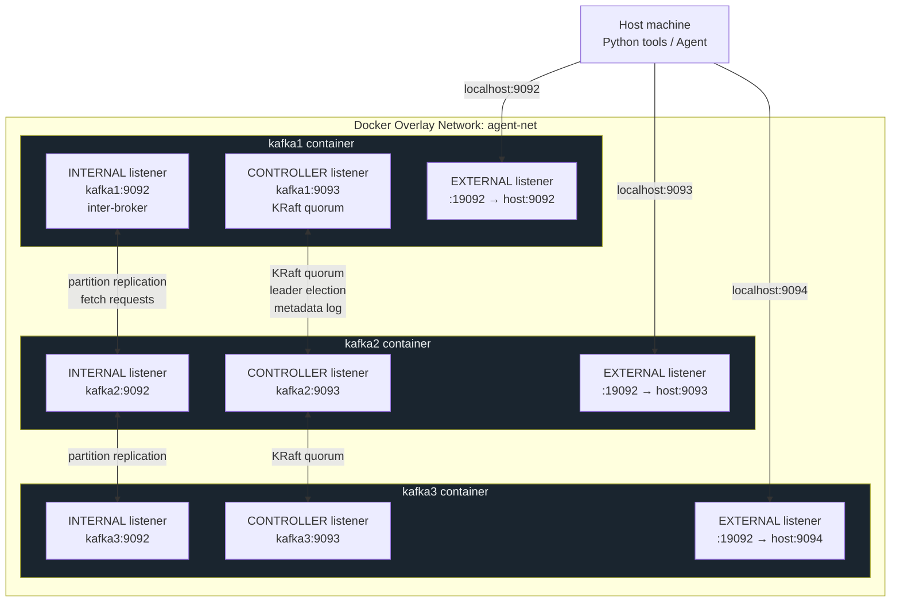
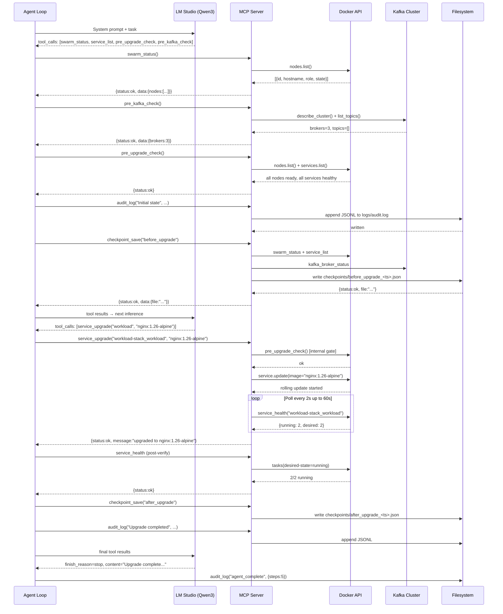

# Architecture

## System Components



---

## MCP Server Tool Map



---

## Kafka Cluster — KRaft Mode



---

## Data Flow: Service Upgrade



---

## Checkpoint Structure

Each checkpoint is a JSON snapshot of the entire infrastructure state at a point in time:

```
checkpoints/
├── before_upgrade_1741204069.json
├── after_upgrade_1741204115.json
└── e2e_pre_upgrade_1741204032.json
```

```json
{
  "label": "before_upgrade",
  "timestamp": "2026-03-05T19:07:49Z",
  "swarm": {
    "status": "ok",
    "data": {
      "nodes": [
        { "id": "0sj1zr8f1pcm", "hostname": "docker-desktop",
          "role": "manager", "state": "ready", "availability": "active" }
      ]
    }
  },
  "services": {
    "status": "ok",
    "data": {
      "services": [
        { "name": "workload-stack_workload",
          "image": "nginx:1.25-alpine",
          "desired_replicas": 2, "running_replicas": 2 }
      ]
    }
  },
  "kafka": {
    "status": "ok",
    "data": { "brokers": [...], "count": 3, "controller_id": 1 }
  }
}
```

---

## Audit Log Format

`logs/audit.log` — JSONL, one entry per line, append-only:

```jsonl
{"timestamp":"2026-03-05T19:07:49Z","action":"agent_start","result":{"task":"rolling_upgrade","model":"lmstudio-community/..."}}
{"timestamp":"2026-03-05T19:07:51Z","action":"tool:swarm_status","result":{"args":{},"result_status":"ok"}}
{"timestamp":"2026-03-05T19:07:52Z","action":"tool:pre_kafka_check","result":{"args":{},"result_status":"ok"}}
{"timestamp":"2026-03-05T19:07:53Z","action":"Initial system check","result":"All gates passed"}
{"timestamp":"2026-03-05T19:07:55Z","action":"checkpoint_save","result":{"label":"before_upgrade","file":"..."}}
{"timestamp":"2026-03-05T19:08:02Z","action":"tool:service_upgrade","result":{"args":{"name":"workload-stack_workload","image":"nginx:1.26-alpine"},"result_status":"ok"}}
{"timestamp":"2026-03-05T19:08:12Z","action":"Upgrade completed successfully","result":"nginx:1.26-alpine healthy 2/2"}
{"timestamp":"2026-03-05T19:08:14Z","action":"agent_complete","result":{"steps":5}}
```
