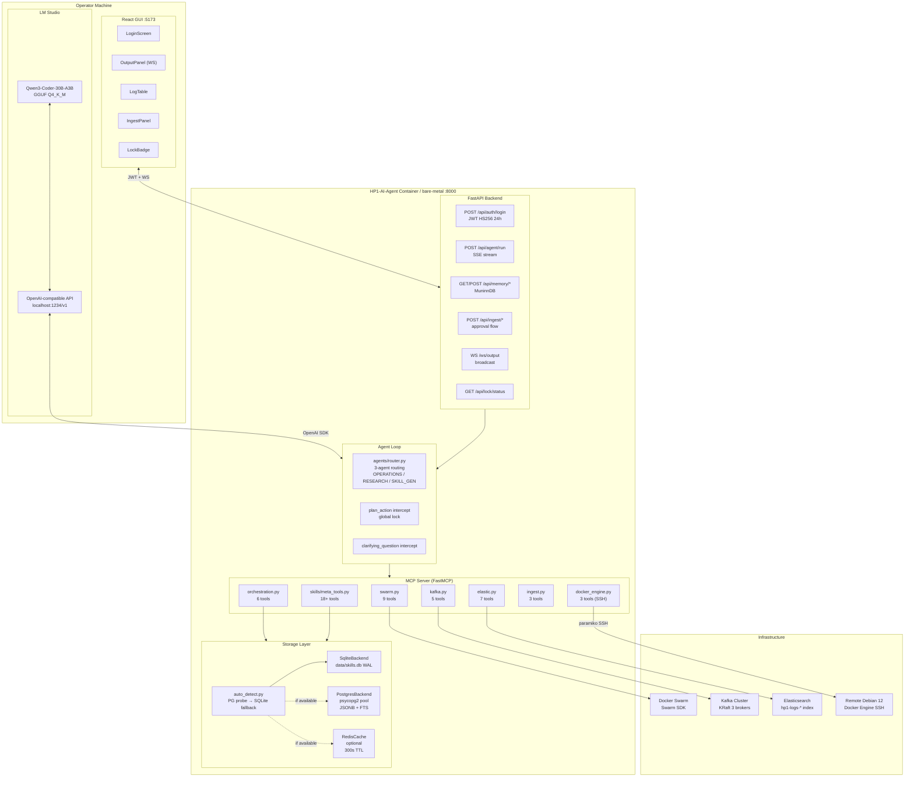
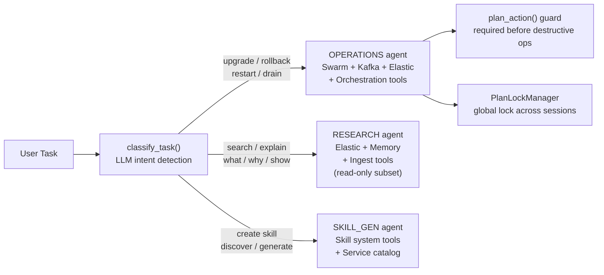
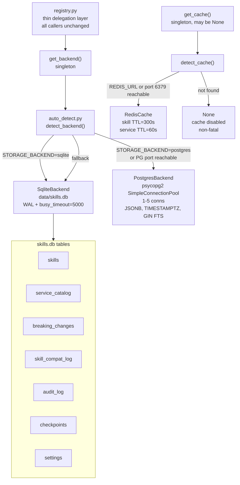
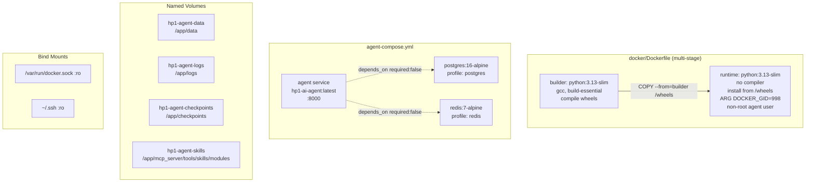
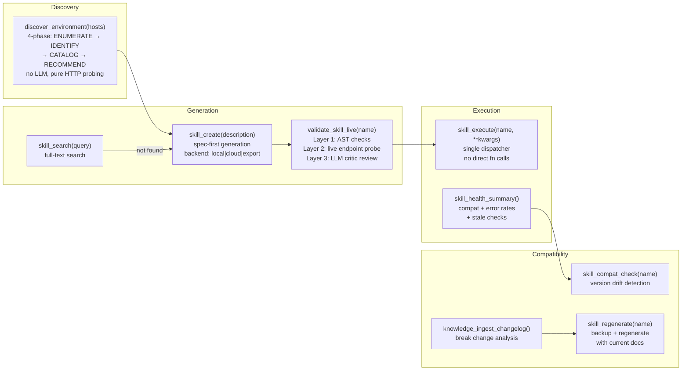
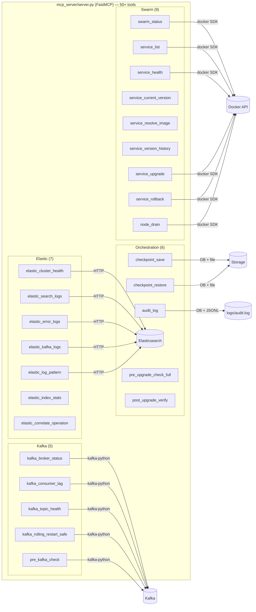
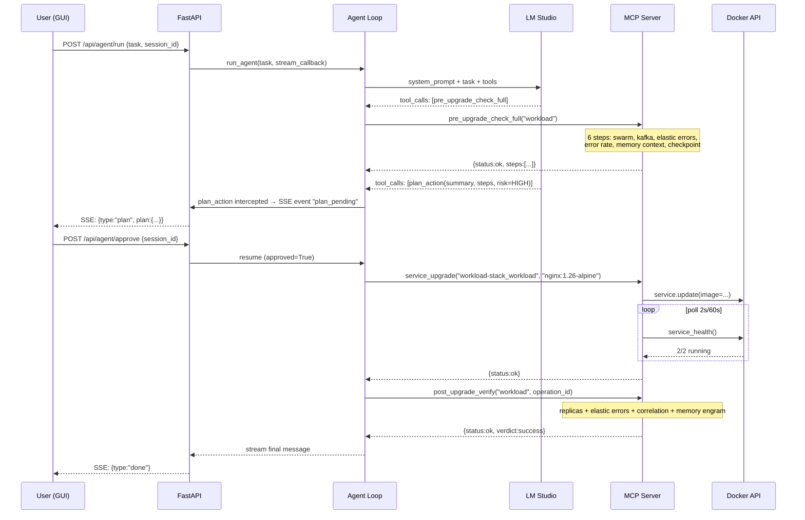

# Architecture

## System Components



---

## 3-Agent Routing

Tasks are classified into one of three agent profiles, each with a filtered tool set:



---

## Storage Layer



**Auto-detection probe order:**
1. `STORAGE_BACKEND` env var override (`sqlite` | `postgres`)
2. `DATABASE_URL` env var (full DSN)
3. `POSTGRES_HOST` env var (individual vars)
4. Network probe: `postgres`, `postgresql`, `db`, `database`, `host.docker.internal`, `172.17.0.1` on port 5432
5. SQLite fallback — always available, zero config

---

## Docker Deployment



**Deploy commands:**
```bash
# Standalone
docker compose -f docker/agent-compose.yml up -d

# With PostgreSQL
docker compose --profile postgres -f docker/agent-compose.yml up -d

# With PostgreSQL + Redis
docker compose --profile postgres --profile redis -f docker/agent-compose.yml up -d

# Swarm HA (requires external overlay network)
docker stack deploy -c docker/agent-swarm.yml hp1-agent
```

---

## Skill System



---

## MCP Server Tool Map



---

## Audit + Checkpoint Dual-Write

Both audit entries and checkpoints are written to two places simultaneously:

```
checkpoint_save(label) / audit_log(action, result)
        │
        ├── PRIMARY: StorageBackend.save_checkpoint() / .append_audit()
        │   └── SQLite: data/skills.db  (or PostgreSQL)
        │       Survives container restarts, queryable, concurrent-safe
        │
        └── SECONDARY: filesystem
            ├── checkpoints/label_timestamp.json  (portable, tail-f)
            └── logs/audit.log  (JSONL, append-only)
```

---

## Data Flow: Service Upgrade (v1.9)


